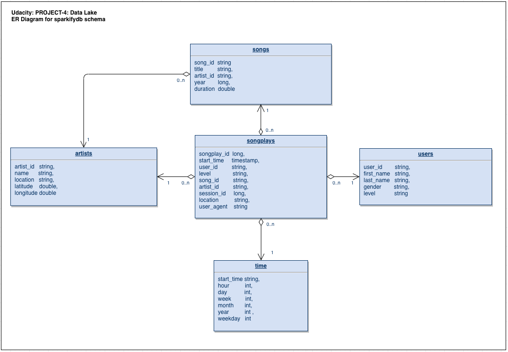

_(Udacity: Data Engineering Nano Degree) | jukka.kansanaho@gmail.com | 2019-06-09_
_This project is a part of [Udacity's Data Engineer Nano Degree](https://eu.udacity.com/course/data-engineer-nanodegree--nd027)._

# PROJECT-4: Data Lake

## Quick start

First, rename dl_template.cfg to dl.cfg and fill in the open fields. Fill in AWS acces key (KEY) and secret (SECRET).

Example data is in data folder. To run the script to use that data, do the wfollowing:

* Create an AWS S3 bucket.
* Edit dl.cfg: add your S3 bucket name.
* Copy **log_data** and **song_data** folders to your own S3 bucket.
* Create **output_data** folder in your S3 bucket.
* NOTE: You can also run script locally and use local input files. Just comment/uncomment rows in `etl.py` main() function.

After installing python3 + Apache Spark (pyspark) libraries and dependencies, run from command line:

* `python3 etl.py` (to process all the input JSON data into Spark parquet files.)

---

## Overview

This Project-4 handles data of a music streaming startup, Sparkify. Data set is a set of files in JSON format stored in AWS S3 buckets and contains two parts:

* **s3://udacity-dend/song_data**: static data about artists and songs
  Song-data example:
  `{"num_songs": 1, "artist_id": "ARJIE2Y1187B994AB7", "artist_latitude": null, "artist_longitude": null, "artist_location": "", "artist_name": "Line Renaud", "song_id": "SOUPIRU12A6D4FA1E1", "title": "Der Kleine Dompfaff", "duration": 152.92036, "year": 0}`

* **s3://udacity-dend/log_data**: event data of service usage e.g. who listened what song, when, where, and with which client
  

Below, some figures about the example data set (results after running the etl.py):

* s3://udacity-dend/song_data: 14897 files
* s3://udacity-dend/log_data: 31 files

Project builds an ETL pipeline (Extract, Transform, Load) to Extract data from JSON files stored in AWS S3, process the data with Apache Spark, and write the data back to AWS S3 as Spark parquet files. As technologies, Project-4 uses python, AWS S3 and Apache Spark.

As a local run on laptop, pipeline takes around 1min 40sec to execute with the given test data set.

Running the same ETL script in AWS us-west-2 (spark machine, input_data S3 and output_data S3 buckets all in the same region) with 1 song_data JSON file and 1 log_data JSON file took 8min 16sec. See details below:

* Reading 1 JSON file from song_data: 11.2sec
* Processing and writing songs_table: 23.8sec
* Processing and writing artists_table: 19.6sec
* Reading 1 JSON file from log_data: 1.3sec
* Processing and writing users_table: 1min 3.9sec
* Processing and writing time_table: 2min 56.2sec
* Processing and writing songplays_table: 2min 49.6sec

NOTE: ETL script has been tested with limited input data (stored in S3) due to very slow S3 read and write procedure.

---

## About Database

Sparkify analytics database (called here sparkifydb) schema has a star design. Start design means that it has one Fact Table having business data, and supporting Dimension Tables. Star DB design is maybe the most common schema used in ETL pipelines since it separates Dimension data into their own tables in a clean way and collects business critical data into the Fact table allowing flexible queries.
The Fact Table answers one of the key questions: what songs users are listening to. DB schema is the following:



_*SparkifyDB schema as ER Diagram.*_

### Purpose of the database and ETL pipeline

In context of Sparkify, this Data Lake based ETL solution provides very elastic way of processing data. As pros, we can mention the following:

* Collecting input data to AWS S3, process the data as needed, and write it back to S3 without maintaining a separate database for intermediate or final data.
* This solution is most probably also less expensive as alternative database solutions like PostgresSQL DB or Redshift since AWS processing resources are needed only during the data processing, not for collecting or storing the data.
* Data processing is also fast, since Spark executes data processing in RAM and as a cluster which offers parallel processing capabilities.
* Spark creates schema on-the-fly, so separate schema design is not necessary needed.

However, as cons we could mention the following:

* Intensive RAM need on Spark cluster nodes.
* Also, data loading from S3 and to S3 may take more time than in alternative solutions utilising DB solutions since network connection is the slowest part of the ETL pipeline (compared to accessing data from RAM or processing data in CPU).
* In addition, S3 seems to be (as an object store) sub-optimal for storing Spark parquet type of files that might be very small and lots of them. So, Spark DataFrame partitioning needs careful attention.
* AWS account type also impacts S3 performance and throughput, which in turn impacts ETL pipeline script performance. E.g. if using AWS Education account type, S3 performance and hence ETL script performance may be very poor.
* One suggestions among Spark users seems to be read input data from S3, process it in Spark, write output data to parquet file locally, and upload generated parquet files to S3 as a patch procedure.

### Raw JSON data structures

* **log_data**: log_data contains data about what users have done (columns: event_id, artist, auth, firstName, gender, itemInSession, lastName, length, level, location, method, page, registration, sessionId, song, status, ts, userAgent, userId)
* **song_data**: song_data contains data about songs and artists (columns: num_songs, artist_id, artist_latitude, artist_longitude, artist_location, artist_name, song_id, title, duration, year)

Findings:

* Input data was available first offline during the development phase and later from s3://udacity-dend/song_data and s3://udacity-dend/log_data
* As expected, reading and especially writing data (song_data, log_data) to and from S3 is very slow process due to large amount of input data and slow network connection. See above for figures with 1 song_data file and 1 log_data file.

### Fact Table

* **songplays**: song play data together with user, artist, and song info (songplay_id, start_time, user_id, level, song_id, artist_id, session_id, location, user_agent)

### Dimension Tables

* **users**: user info (columns: user_id, first_name, last_name, gender, level)
* **songs**: song info (columns: song_id, title, artist_id, year, duration)
* **artists**: artist info (columns: artist_id, name, location, latitude, longitude)
* **time**: detailed time info about song plays (columns: start_time, hour, day, week, month, year, weekday)

Findings:

* Output data was written to own AWS S3 bucket.
* Both Fact table (songplays) and Dimension tables (users, songs, artists, time) are extracted from inout data and written back to S3 as Spark parquet files.
* Each time `etl.py` is run, it creates new directories for each table to output_data/ directory based on the script start time (e.g. songs_table.parquet_2019-06-10-10-07-20-873438). This way there's no collision or need to erase old data between different runs.
* Spark writes temporary folders and files during the parquet file creation process. Used AWS S3 user requires admin rights for Spark to be able to rename (copy + paste + delete) created temp folders and files.
* In overall, network speed, processing speed, data read & write speed depends heavily on used (AWS) cloud resources. Faster CPU, more RAM, faster disks, faster network connection obviously give better start-to-end time for whole ETL pipeline.
* ETL script requires some optimisation for bigger data amounts (e.g. write parquet files locally and only then upload them to S3).

---

## HOWTO use

**Project has one script:**

* **etl.py**: This script uses data in s3:/udacity-dend/song_data and s3:/udacity-dend/log_data, processes it, and inserts the processed data into DB.

### Prerequisites

Python3 is recommended as the environment. The most convenient way to install python is to use Anaconda (https://www.anaconda.com/distribution/) either via GUI or command line.
Also, the following libraries are needed for the python environment to make Jupyter Notebook and Apache Spark to work:

* _pyspark_ (+ dependencies) to enable script to create a SparkSession. (See https://spark.apache.org/docs/latest/api/python/pyspark.sql.html)
* NOTE: in the beginning of the execution, script downloads hadoop-aws package to enable connection to AWS.

### Run etl.py

Type to command line:

`python3 etl.py`

* Script executes Apache Spark SQL commands to read source data (JSON files) from S3 to memory as Spark DataFrames.
* In memory, data is further manipulated to analytics DataFrames.
* Analytics dataFrames are stored back to S4 as Spark parquet files.
* Script writes to console the query it's executing at any given time and if the query was successfully executed.
* Also, script writes to console DataFrame schemas and show a handful of example data.
* In the end, script tells if whole ETL-pipeline was successfully executed.

Output: input JSON data is processed and analysed data is written back to S3 as Spark parquet files.

## Data cleaning process

`etl.py` works the following way to process the data from source files to analytics tables:

* Loading part of the script (COPY from JSON to staging tables) query takes the data as it is.
* When inserting data from staging tables to analytics tables, queries remove any duplicates (INSERT ... SELECT DISTINCT ...).

## Example queries

* NOTE: There are some example queries implemented in `etl.py` and executed in the end of the script run.
* Get users and songs they listened at particular time. Limit query to 1000 hits:

```
SELECT  sp.songplay_id,
        u.user_id,
        s.song_id,
        u.last_name,
        sp.start_time,
        a.name,
        s.title
FROM songplays AS sp
        JOIN users   AS u ON (u.user_id = sp.user_id)
        JOIN songs   AS s ON (s.song_id = sp.song_id)
        JOIN artists AS a ON (a.artist_id = sp.artist_id)
        JOIN time    AS t ON (t.start_time = sp.start_time)
ORDER BY (sp.start_time)
LIMIT 1000;
```

* Get count of rows in each Dimension table:

```
SELECT COUNT(*)
FROM songs_table;

SELECT COUNT(*)
FROM artists_table;

SELECT COUNT(*)
FROM users_table;

SELECT COUNT(*)
FROM time_table;
```

* Get count of rows in Fact table:

```
SELECT COUNT(*)
FROM songplays_table;
```

## Summary

Project-4 provides customer startup Sparkify tools to analyse their service data in a flexible way and help them answer their key business questions like "Who listened which song and when?"
